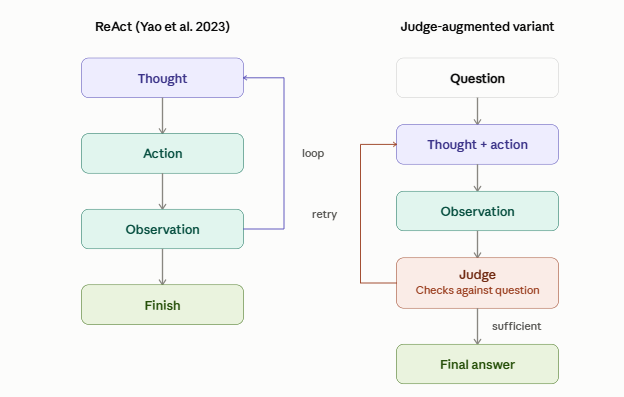
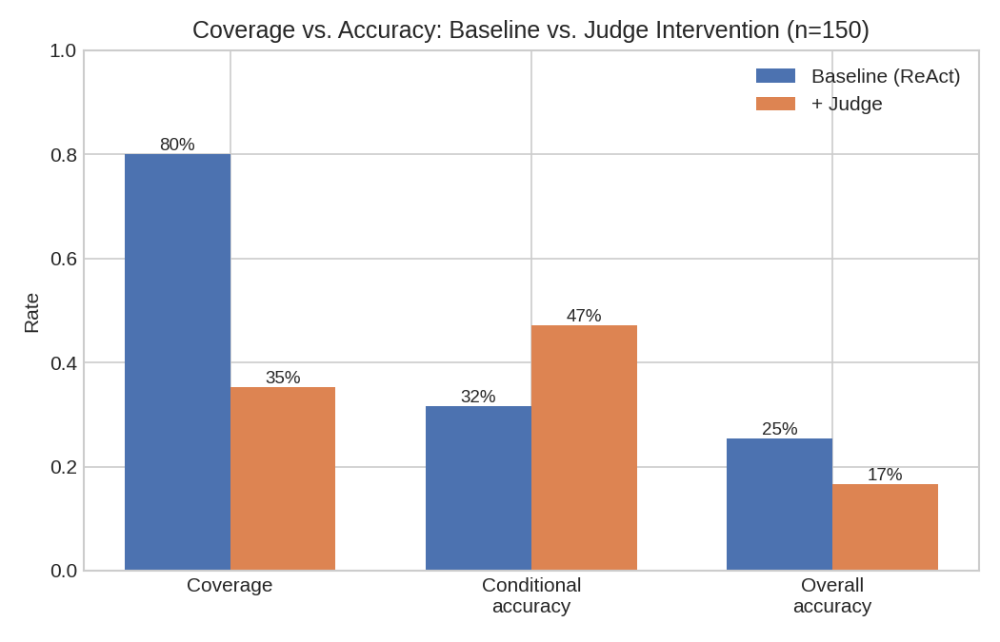

# ReAct Multi-Hop Reasoning with a Mid-Loop LLM Judge

This project explores whether an external LLM can help a [ReAct](https://arxiv.org/html/2210.03629v3) agent make better decisions while it is still reasoning.

The agent solves multi-hop questions from [HotpotQA](https://arxiv.org/abs/1809.09600) using Wikipedia as its external knowledge source. After each tool-use step, a second LLM looks at the trajectory and decides whether the agent should continue searching or whether it has enough evidence to answer.

- **Agent:** Qwen2.5-7B-Instruct  
- **Judge:** Mistral-7B-Instruct-v0.3  
- **Dataset:** HotpotQA  
- **Hardware:** T4 GPU with 4-bit quantization

This is a small-scale personal research project and the current evaluation is intentionally limited to 150 questions.

---

## Overview

The baseline uses a standard [ReAct](https://arxiv.org/abs/2210.03629) loop and then the modified version adds an external judge inside the loop:



## Motivation

ReAct agents can solve multi-hop questions by repeatedly searching for information, but the agent can also stop with incomplete evidence.

I wanted to test a simple idea:

> Can another model notice that the current trajectory is not sufficient before the agent commits to an answer?

The project is inspired by work on reasoning verification and judging, including [SAFE](https://arxiv.org/abs/2604.01993) and [Reasoning Court](https://arxiv.org/abs/2504.09781)

## Implementation

### ReAct Agent

The agent follows the usual Thought / Action / Observation format.

It has three possible actions:
```text
Search[entity]
Lookup[keyword]
Finish[answer]
```
- **Search** retrieves the relevant Wikipedia page.

- **Lookup** searches the currently opened page for a specific keyword.

- **Finish** returns the final answer.

The baseline is limited to 7 hops.

### External Judge

After a Search or Lookup step, the judge receives the trajectory collected so far.

For instance:
```text
Question: ...

Thought 1: ...
Action 1: Search[...]
Observation 1: ...

Thought 2: ...
Action 2: Search[...]
Observation 2: ...
```
The judge then decides whether the evidence is sufficient.
```text
Decision: CONTINUE
Feedback: Find the nationality of the director.
```
or

```text
Decision: ANSWER
```
Experiment
Ran both versions on the same fixed sample of 150 HotpotQA questions.

#### Baseline
- Qwen2.5-7B-Instruct
- Wikipedia Search / Lookup
- Maximum 7 hops
#### Judge Intervention
- Qwen2.5-7B-Instruct
- Mistral-7B-Instruct-v0.3 as the judge
- Judge called during the ReAct trajectory
- Wikipedia tools
## Results
The judge version was more accurate when it successfully produced an answer, but it also failed to produce an answer much more often.

|  | Baseline ReAct | Judge |
| :--- | ---: | ---: |
| Coverage | 80.0% | 35.3% |
| Conditional Accuracy | 31.7% | 47.2% |
| Overall Accuracy | 25.3% | 16.7% |



The main reason turned out to be parse errors.
**Parse Errors:** There were 42 parse errors in the judge condition. All 42 occurred immediately after a judge CONTINUE decision. This pointed to a problem in how the judge feedback was being added to the next ReAct prompt.
## Key Findings
- **Mid-loop judging improved conditional accuracy**: when the judge allowed the agent to produce an answer, accuracy was 47.2%, compared with 31.7% for the baseline.
- **Judge coverage was much lower**: the judged agent produced usable final answers for only 35.3% of questions, compared with 80.0% for the baseline.
- **Overall accuracy decreased**: because of the reduced coverage, the judge system achieved 16.7% overall accuracy, compared with 25.3% for the baseline.
- **Main implementation failure was parsing**: There were 42 judge-condition parse errors and all 42 occurred immediately after a CONTINUE decision.

## Setup

Install the required packages:
```bash
pip install -r requirements.txt
```
## Run Results

The experiments can be run from the project root.
**Baseline Results:**
```bash
python src/react_baseline.py
```
**Judge Intervention**
```bash
python src/external_verification.py
```
The output is stored as JSONL so that results can be written question by question.

## Project Structure

```text
ReAct_Multi-Hop-Questions/
│
├── configs/
│   └── experiment.yaml
│
├── results/
│   ├── results_baseline.jsonl
│   ├── results_judge_intervention.jsonl
│   └── figures/
│       ├── coverage_accuracy.png
        ├── diagram.png
│       ├── stopped_reason.png
│
├── src/
│   ├── agent_tools.py
│   ├── external_verification.py
│   ├── models.py
│   ├── prompts.py
│   └── react_baseline.py
│
├── .gitignore
├── README.md
└── requirements.txt
```
